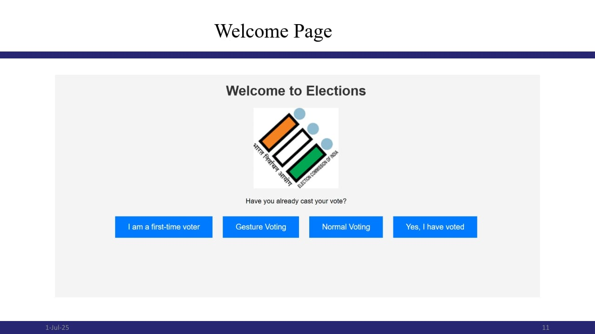
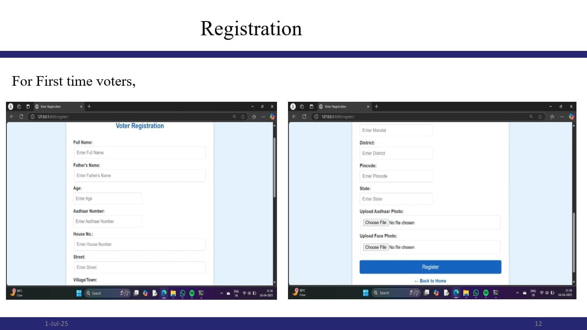
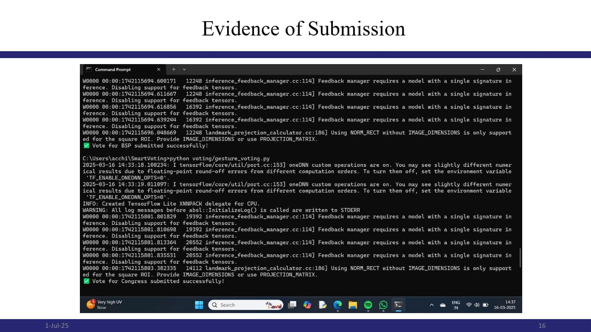
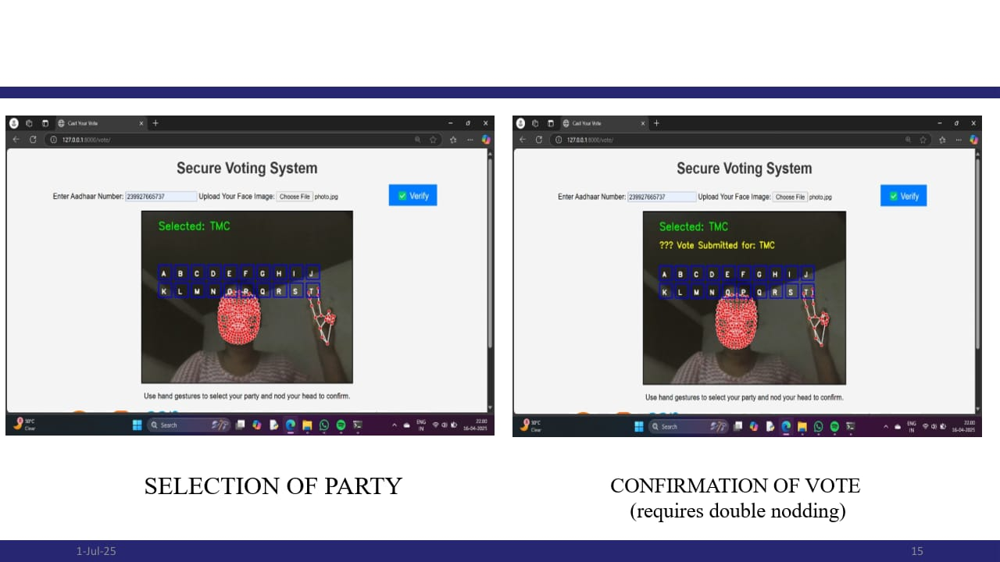
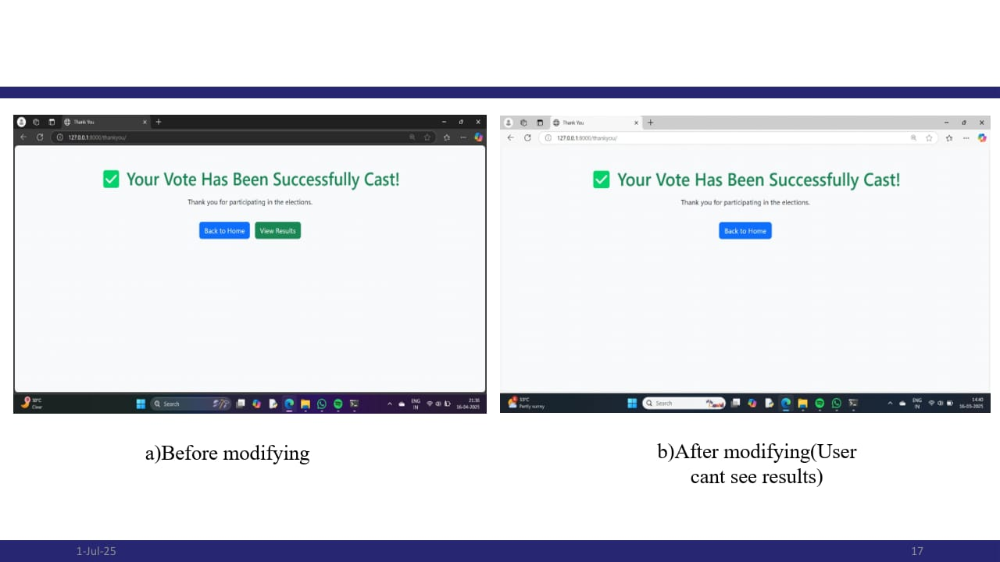

# 👁️ Gesture-Based E-Voting System

A secure and accessible online voting system where users can cast their votes using **facial gestures** like **hand movements, eyebrow raises, or nose movements**, with a **virtual keyboard** for input — built to help **elderly and differently-abled users** participate in digital voting without hurdles.

> 💡 This was my **college mini project**, inspired by real-world challenges faced by elders in accessing traditional voting systems. I loved working on it because solving real problems is where my heart truly lies.

---

## 🔧 Tech Stack

- 🎯 **Frontend**: HTML, CSS, JavaScript  
- 🧠 **Gesture Recognition**: Python, OpenCV, MediaPipe, Dlib  
- 🛠️ **Backend**: Django (for secure data handling & validation)

---

## 🎯 Features

- ✅ Face gesture detection (eyebrow, nose, or hand movements)
- ✅ Virtual keyboard for hands-free voting
- ✅ Django-based secure backend with vote validation
- ✅ Simple UI with accessibility in mind
- ✅ Real-time gesture recognition using webcam

---

## 💻 Screenshots

### 🖥️ Welcome Page
> The entry point of the system designed for simplicity and accessibility.

### 📝 Voter Registration
> Users register using basic details to proceed with gesture-based voting.

### 🧠 Evidence Collection
> Captures facial features and gesture samples for verification.

### 🗳️ Voting Process
> Users vote using facial gestures or virtual keyboard — fully accessible.

### ✅ Vote Confirmation
> A clear confirmation message ensures the vote is counted successfully.

---

## 🚀 Getting Started

> Follow these steps to run the project locally:

### 1. Clone the repo

git clone https://github.com/Bavya20/Smart-E-voting-System.git , 
cd Smart-E-voting-System

---

## ❤️ Why This Project Matters to me

Elderly and differently-abled people often find it hard to interact with conventional voting systems. This project was born out of a desire to make technology accessible for everyone — especially those often left out.

The goal is to use AI and gesture recognition to create something meaningful and usable in the real world. 🌍

